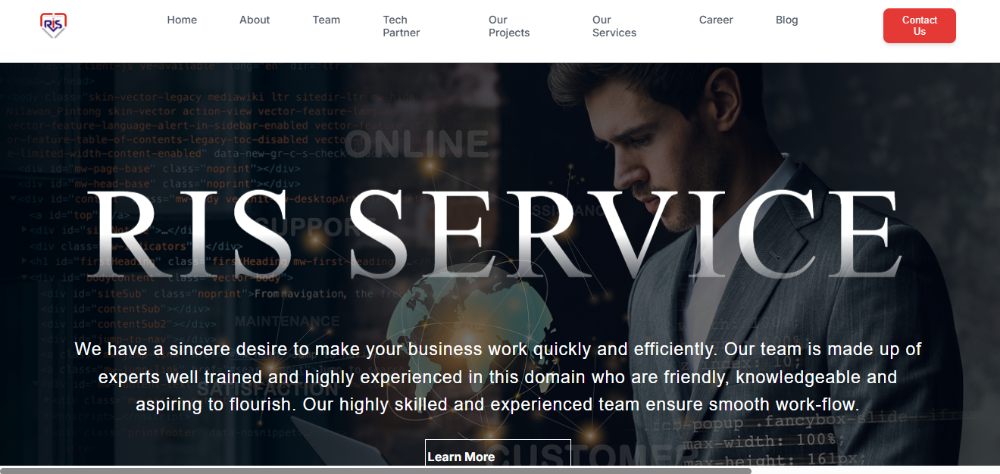

# Ris-services
RIS Services - Web Page

This is a simple static webpage created for **RIS Services** using **HTML** and **CSS**.  
The project showcases the services and information about RIS in a clean and responsive layout.

# Features
- Built with pure **HTML5** and **CSS3**
- Responsive and user-friendly design
- Easy to customize and extend

# Project Structure
.
├── index.html # Main webpage
├── style.css # Stylesheet
└── images/ #  Images or icons used

# How to Use
1. Clone or download this repository.
2. Open `home.html` in any web browser.
3. Customize `style.css` and content as per your needs.

# Future Improvements
- Add JavaScript for interactivity.
- Create multiple pages for services, contact, and about.
- Enhance responsiveness with advanced CSS or frameworks.

# Live Demo
### Homepage

### Contact Page

---
👩‍💻 Developed as part of a frontend project for **RIS Services**.
